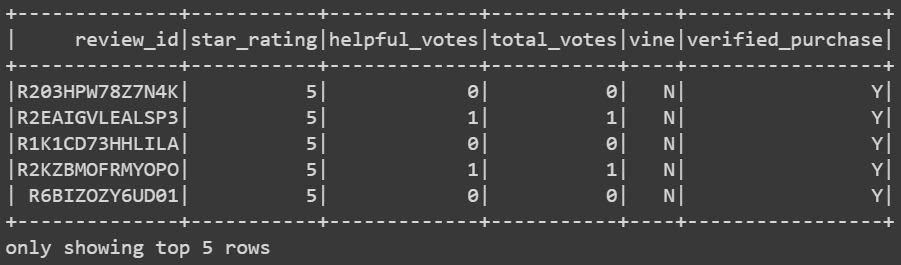
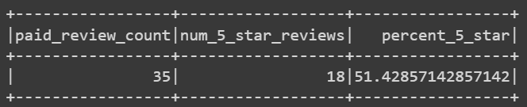
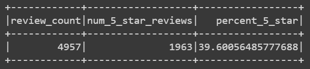
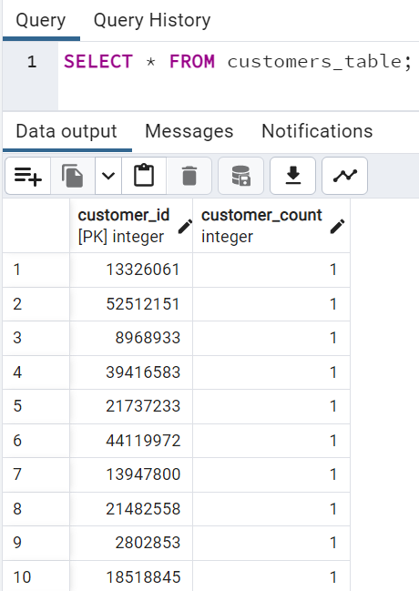
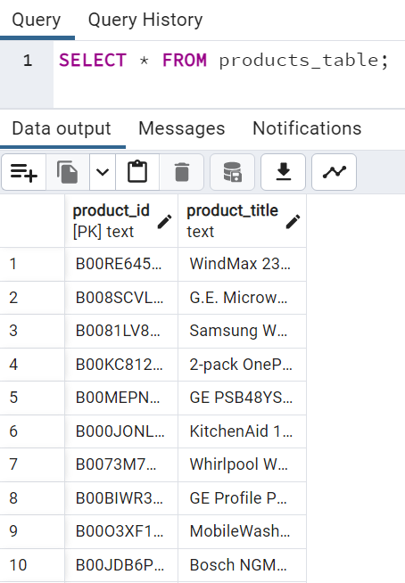
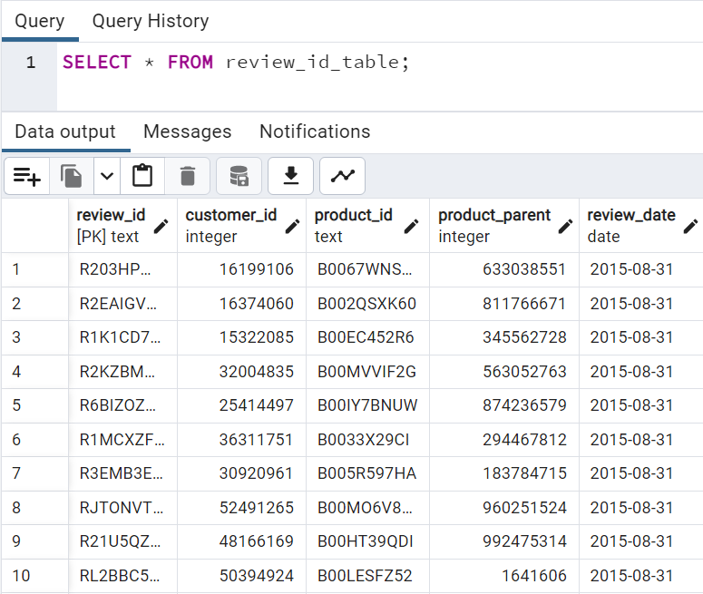
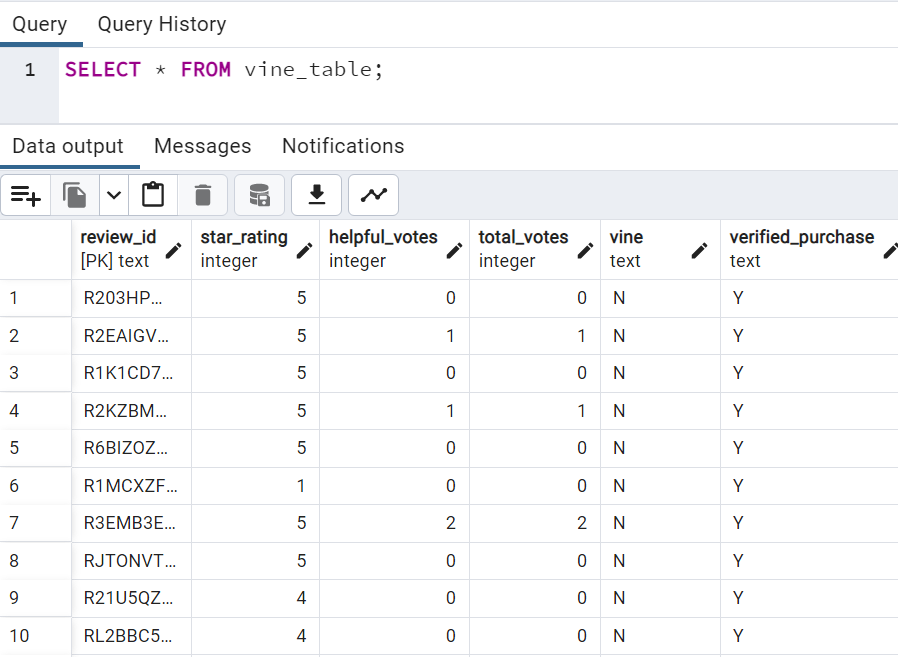

# Amazon_Vine_Analysis

## Overview

The Amazon Vine program allows companies to provide a potential customer with a product at no cost in exchange for a review plus a small fee paid by the company to Amazon. This purose of this analysis is to determine if there is a possible link between the Vine program and a higher proportion of positive reviews. Only reviews from one product category that originated from customers in the U.S. were included.

### Tools
- Amazon RDS
- Google Colab
- Spark using pyspark
- pgAdmin 4

### Methods

The data for the Major Appliances category was obtained from [source](https://s3.amazonaws.com/amazon-reviews-pds/tsv/amazon_reviews_us_Major_Appliances_v1_00.tsv.gz) and loaded into a relational database hosted by AWS and operating PostgreSQL for storage and future analysis. A table including information specific to the analysis of the vine program was created using Spark after the full dataset was loaded. The first five rows are shown below:

This DataFrame was further filtered so that only reviews with more than twenty votes that were determined to be helpful, the ratio of helpful votes to total votes being one half or greater, remained. Two DataFrames were then created, one for Vine reviews and another for unpaid reviews.

From these new DataFrames the total number of reviews of each type, the number of five star reviews, and the percetage of reviews which were five star was determined.

## Results

### Vine Reviews

Shown above are the results for Vine program or paid reviews.
- After filterinng there were 35 Vine reviews that were deemed helpful overall and recieved 20 or more votes.
- Of these 35, 18 reviews gave thee product 5 stars.
- After filtering, around 51.43% of the Vine program reviews gave the product a rating of 5 stars.

### Unpaid Results

Results for the unpaid or non-Vine program reviews are shown above.
- After filtering, 4957 non-Vine reviews remained.
- Of these, 1963 gave the product a 5 star rating.
- About 39.6% of the filtered reviews gave the product a 5 star rating.

## Summary

Based soley on methods and results outlined above, ther does appear to be a bias towards 5 star reviews among Vine program participants as compared to non-Vine reviews. While the clear difference in the percentage of 5 star reviews is compelling, it is not sufficient to draw a firm conclusion from. A non-exhaustive list of potential factors, not all of these could be extracted from this data and indeed some may not have a practical route to resolution:
- A small number of Vine reviews satisfying the filters applied.
- Unknown bias in the sample. For instance, how was each Vine reviewer selected? In the non-Vine reviews many unknown factors could influence the purchase and subsequent review. A few examples may be the consumer's perception of the brand,  did the consumer previously use an older model of the item they purchased, or was the consumer forced into a particular bracket by a constraint such as price or location of manufacture.
- Does this customer have a pattern of giving unusually positive or negative reviews, or are their reviews generally voted to be helpful or unhelpful.
- Is the type of consumer who votes on how helpful a review is the target for a particular product, put differently, is there a demographic pattern to these customers such as age.
- Is there a link between how long a review is and how helpful it is considered.
- Are reviews including pictures more helpful?

Given the analysis performed and the recognition that potentially influential factors are not accounted for, we may conclude that there appears to be a bias towards positive reviews in the Vine program but the significance of this result is unclear.

Using this data, there are other potential avenues to attempt to understand the significance of our result. One option is to include the "product_id" column from the original data in the DataFrame with columns selected specifically for the Vine program analysis. This would allow grouping reviews by product to better understand bias between reviews that are directly related.

Another potential course is to determine is any of the customers in the data have both Vine and non-Vine reviews attributed to them. The combined Vine and non-Vine reviews from this subset could be compared for potential bias.

Both of these suggestions struggle with many of the pitfalls listed above, however, they may control for or reduce the impact of a confounding variable. The addition of either set of calculations may aid in determining the significance of the original result.

## Appendix: RDS Tables

Below are examples of the tables created in PostgreSQL database using the raw data.

### Customers Table

### Products Table

### Review id Table

### Vine Table
